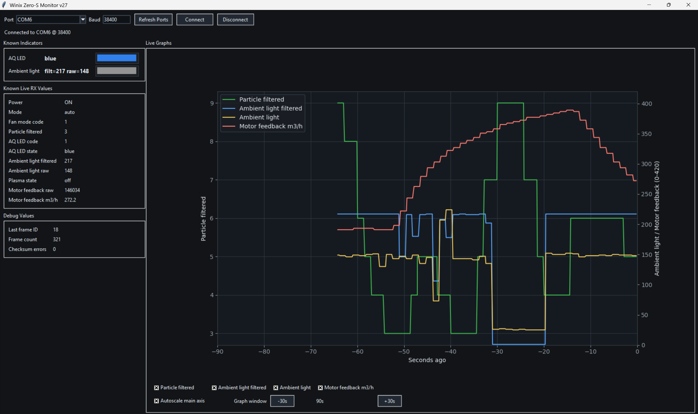

# Winix Zero-S Purifier Monitor

RX-only UART monitor for observing the debug/status stream from a Winix Zero-S air purifier.

This repository intentionally publishes only the current v28 source and Windows executable.

## Files

- `winix_monitor_v28.py` - Python source for the monitor.
- `dist/WinixMonitor_v28.exe` - Windows executable build of v28.

## What It Shows



- Power state
- Fan mode / speed
- Particle filtered value
- AQ LED state
- Ambient light filtered and raw values
- Plasma state
- Motor feedback raw value
- Estimated motor feedback in m3/h
- Last frame ID, frame count, and checksum errors

## Connection

- Hardware: USB-to-serial TTL adapter connected to the purifier debug header.
- UART: `38400 8N1`
- Frame format: `F0 ID LEN ... CHK`
- Checksum: 8-bit sum of the previous bytes in the frame

Version 27 treats the debug header as RX/status-only. Earlier TX command experiments did not control the purifier, so transmit controls were removed.

For monitoring, connect the adapter ground to the purifier debug-header ground and the adapter RX input to the debug-header TX/status output. Do not connect mains voltage or RS-232 serial hardware to the TTL debug header.


PCB photo source: EEVblog forum thread, [Hacking an air purifier - how to approach triggering button pushes on its PCB](https://www.eevblog.com/forum/beginners/hacking-an-air-purifier-129300-how-to-approach-triggering-button-pushes-on-its-p/).

Pin order from top to bottom:

- Pin 1: `5V`
- Pin 2: `GND`
- Pin 3: `RX`
- Pin 4: `TX`

Minimal monitor connection:

- Purifier `GND` to USB-to-serial `GND`
- Purifier `TX` to USB-to-serial `RX`
- Leave purifier `5V` unconnected for normal monitoring

## Run the Windows App

Download or open:

```text
dist/WinixMonitor_v28.exe
```

Select the serial port, keep the baud rate at `38400`, and click `Connect`.

## Run From Source

```bash
python winix_monitor_v28.py
```

Python dependencies:

- `pyserial`
- `matplotlib`
- `tkinter`

Install the Python packages with:

```bash
python -m pip install pyserial matplotlib
```

`tkinter` is included with many Python installs. On Linux it may need to be installed through the system package manager.
